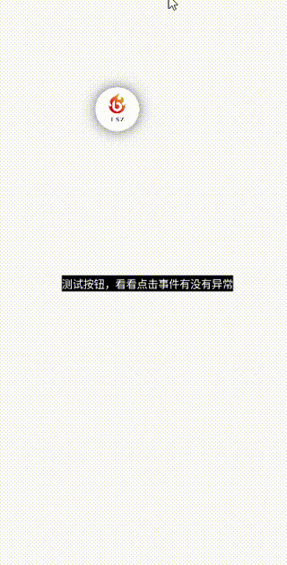

# 先上效果图

## 代码样例
in you activity
<br>
kt
```kotlin
    nbFloatView = NBFloatView(this)
    //add to window
    nbFloatView?.addSelfToWindow()
    //点击事件
    nbFloatView?.setOnClickListener(object : OnClickListener{
        override fun click(view: NBFloatView) {
            Toast.makeText(this@FloatViewActivity, "点击了悬浮按钮", Toast.LENGTH_SHORT).show()
        }
    })
    //在NBFloatView上绘制一个圆
    nbFloatView?.setMode(object : OnDrawListener{
        override fun onDraw(rectF: RectF, canvas: Canvas? , view: NBFloatView , paint: Paint?) {
            val cx = rectF.left + rectF.width() / 2
            val cy = rectF.top + rectF.height() / 2
            val radius = min(rectF.width() , rectF.height()) / 2
            canvas?.drawCircle(cx , cy , radius , paint!!)
        }
    })
    //在NBFloatView上绘制一张图
    nbFloatView?.setOnDrawListener(object : OnDrawListener{
        override fun onDraw(rectF: RectF, canvas: Canvas?, view: NBFloatView, paint: Paint?) {
            val saveCount = canvas?.saveCount ?: 0
            val shadowRadius = 40f // 阴影半径
            // 设置阴影效果
            paint?.setShadowLayer(shadowRadius, 0f, 0f, Color.parseColor("#99000000"))
            paint?.color = 0xFFFFFFFF.toInt()
            canvas?.drawRoundRect( RectF(rectF.left + shadowRadius / 2 , rectF.top + shadowRadius / 2 , rectF.right - shadowRadius / 2 , rectF.bottom - shadowRadius / 2)  , rectF.width() / 2f , rectF.height() / 2f , paint!!)
            val bitmap = BitmapFactory.decodeResource(resources , R.mipmap.favicon)
            canvas?.drawBitmap(bitmap , null , RectF(rectF.left + shadowRadius / 2 , rectF.top + shadowRadius / 2 , rectF.right - shadowRadius / 2 , rectF.bottom - shadowRadius / 2) , paint)
            canvas?.restoreToCount(saveCount)
        }
    })
```
java
```java
    NBFloatView nbFloatView = new NBFloatView(this);
    nbFloatView.setOnClickListener(new OnClickListener() {
            @Override
            public void click(@NonNull NBFloatView view) {
                Toast.makeText(this@FloatViewActivity, "点击了悬浮按钮", Toast.LENGTH_SHORT).show()
            }
        });
    //绘制一个圆
   nbFloatView.setOnDrawListener(new OnDrawListener() {
            @Override
            public void onDraw(@NonNull RectF rectF, @Nullable Canvas canvas, @NonNull NBFloatView view, @Nullable Paint paint) {
                float cx = rectF.left + rectF.width() / 2;
                float cy = rectF.top + rectF.height() / 2
                float radius = Math.min(rectF.width() , rectF.height()) / 2f;
                canvas.drawCircle(cx , cy , radius , paint);
            }
        });
   //绘制一张图
    nbFloatView.setOnDrawListener(new OnDrawListener() {
            @Override
            public void onDraw(@NonNull RectF rectF, @Nullable Canvas canvas, @NonNull NBFloatView view, @Nullable Paint paint) {
                int saveCount = canvas.getSaveCount();
                float shadowRadius = 40f;
                // 设置阴影效果
                paint.setShadowLayer(shadowRadius, 0f, 0f, Color.parseColor("#99000000"))
                 paint.color = 0xFFFFFFFF
                canvas.drawRoundRect(new RectF(rectF.left + shadowRadius / 2 , rectF.top + shadowRadius / 2 , rectF.right - shadowRadius / 2 , rectF.bottom - shadowRadius / 2)  , rectF.width() / 2f , rectF.height() / 2f , paint)
                Bitmap bitmap = BitmapFactory.decodeResource(getResource() , R.mipmap.favicon);
                canvas.drawBitmap(bitmap , null , rectF , paint);
            }
        });     
```