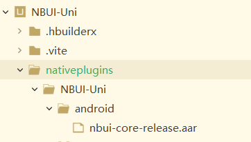

# 使用前须知

1. 该插件仅支持在uni-app中使用，不支持在H5中使用。
2. 该插件仅支持uni-app的vue框架
3. 使用UniNBElasticView时，列表部分仅支持原生封装，如需自定义item，请自行封装实现

## 插件接入（Android）
* 在线自定义基座
  - 在uniapp项目根目录下创建名为nativeplugins的文件夹（一个字也不能错）
  - 在nativeplugins下创建一个目录，取名为你的插件名称，如NBUI-Uni
  - 在插件目录下创建名为android的文件夹，须一字不差
  - 从[release页](https://github.com/RubinTry/NBUI/releases)下载插件压缩包并解压
  - 将下载的aar包挨个放进android目录，如下图所示
  - 继续根据官网教程制作自定义基座，在HBuilderX中，点击运行->运行到手机或模拟器->制作自定义调试基座，基座制作完成后，选择制作好的基座运行即可
  - 编写package.json，代码如下
    ```json
    {
        "name": "NBUI",
        "id": "NBUI-Uni",
        "version": "1.0.0",
        "description": "NBUI，顾名思义，牛bi的UI，这里面包含一些不那么容易在其他UI库中找到的UI组件，主打一个稀有",
        "_dp_type":"nativeplugin",
        "_dp_nativeplugin":{
            "android": {
                "plugins": [
                    {
                        "type": "module",
                        "name": "NBUI-Uni-core",
                        "class": "cn.rubintry.nbui.core.NbuiUniBridge"
                    }
                ],
                "integrateType": "aar",
                "compileOptions": {
                    "sourceCompatibility": "1.8",
                    "targetCompatibility": "1.8"
                },
                "abis": [
                    "armeabi-v7a|arm64-v8a|x86"
                ],
                "minSdkVersion": "21",
                "useAndroidX": true
            }
        }
    }
    ```
  
* 离线打包基座（IDE使用[AndroidStudio](https://developer.android.google.cn/)）
   - 下载最新版[离线打包SDK](https://nativesupport.dcloud.net.cn/NativePlugin/offline_package/android.html)
   - 导入原生工程项目：解压后找到HBuilder-Integrate-AS目录，导入到AndroidStudio
   - 从[release页](https://github.com/RubinTry/NBUI/releases)下载插件压缩包并解压，并[仔细阅读这篇文档](https://nativesupport.dcloud.net.cn/AppDocs/usesdk/android.html#%E6%96%B9%E5%BC%8F%E4%BA%8C-%E5%AF%BC%E5%85%A5%E5%B7%A5%E7%A8%8B)以集成插件
   - [仔细按照这个教程](https://ask.dcloud.net.cn/article/35482)打包自定义基座apk，将apk复制到uniapp项目的根目录->unpackage->debug路径下即可运行

## 插件使用

* 如果你按照教程集成了插件，但发现系统它找不到，则需要在项目根目录下创建vite.config.js，并加入如下代码：
```javascript
import {      
    defineConfig      
} from 'vite'      
import uni from '@dcloudio/vite-plugin-uni'  
const CUSTOM_TAG = ['UniNBElasticView']//把自定义原生组件的名字写入到这里面  
export default defineConfig({      
    plugins: [      
        uni({      
            vueOptions: {      
                template: {      
                    compilerOptions: {  
                        isCustomElement: tag => CUSTOM_TAG.includes(tag)//这样就可以让编译器知道哪些是自定义组件  
                    }      
                }      
            }      
        })      
    ]      
})
```
* 全局配置，需要在NBUI相关的各view调用前配置
```
<script>
    var NBUI = uni.requireNativePlugin("NBUI-Uni-core");
    //悬浮球配置项
    NBUI.config({
        configName: "NBFloatViewConfig",
        width: 200,
        height: 200,
        position: {x: 100 , y: 100},
    }, (msg) => {});

    //弹性下拉View配置项
    NBUI.config({
        configName: "NBElasticPullConfig",
        elasticCoefficient: 0.95,
    }, (msg) => {});
</script>
```


* UniNBFloatView
```javascript
<script>
    var nbuiModule = uni.requireNativePlugi("NBUI-Uni-drag");
    export default {
        onLoad() {
			nbuiModule.attach();
		},
    }
</script>
```
此时，你便可在app上看到悬浮球了

* UniNBElasticView

由于是原生view，因此只能在nvue中才能使用，其中，mListData为列表数据源，仅支持string类型，如需特殊定制，请自行封装实现，[参考](https://nativesupport.dcloud.net.cn/NativePlugin/course/android.html)

```html
<template>
	<div :style="{width: screenWidth , height: screenHeight , backgroundColor: '#ffffff'}">
		<!-- :bgc 组件透明度，支持使用八位数十六进制颜色码，前两位表示不透明度，取值范围00~FF -->
		<UniNBElasticView :bgc="'#88aaaaaa'" :NBWidth=getScreenWidth() :NBHeight=getScreenHeight() headerImagePath="https://rubintry.com.cn:8888/a_logo.png" :dataArray="mListData">
		</UniNBElasticView>
	</div>
</template>
```