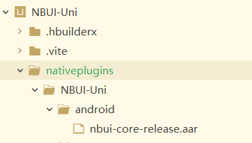

# 使用前须知

1. 该插件仅支持在uni-app中使用，不支持在H5中使用。
2. 该插件仅支持uni-app的vue框架
3. 使用UniNBElasticView时，列表部分仅支持原生封装，如需自定义item，请自行封装实现

## 插件接入（Android）
* 在线自定义基座
  - 在uniapp项目根目录下创建名为nativeplugins的文件夹（一个字也不能错）
  - 在nativeplugins下创建一个目录，取名为你的插件名称，如NBUI-Uni
  - 在插件目录下创建名为android的文件夹，须一字不差
  - 从[release页](https://github.com/RubinTry/NBUI/releases)下载插件压缩包并解压
  - 将下载的aar包挨个放进android目录，如下图所示
  - 继续根据官网教程制作自定义基座，在HBuilderX中，点击运行->运行到手机或模拟器->制作自定义调试基座，基座制作完成后，选择制作好的基座运行即可
  - 编写package.json，代码如下
    ```json
    {
        "name": "NBUI",
        "id": "NBUI-Uni",
        "version": "1.0.0",
        "description": "NBUI，顾名思义，牛bi的UI，这里面包含一些不那么容易在其他UI库中找到的UI组件，主打一个稀有",
        "_dp_type": "nativeplugin",
        "_dp_nativeplugin": {
            "android": {
                "plugins": [{
                        "type": "module",
                        "name": "NBUI-Uni-core",
                        "class": "cn.rubintry.nbui.core.NbuiUniBridge"
                    },
                    {
                        "type": "module",
                        "name": "UniNBFloatView",
                        "class": "cn.rubintry.nbui.drag.UniNBFloatView"
                    },
                    {
                        "type": "component",
                        "name": "UniNBElasticView",
                        "class": "cn.rubintry.nbui.pull.UniNBElasticView"
                    }
                ],
                "integrateType": "aar",
                "compileOptions": {
                    "sourceCompatibility": "1.8",
                    "targetCompatibility": "1.8"
                },
                "abis": [
                    "armeabi-v7a|arm64-v8a|x86"
                ],
                "minSdkVersion": "21",
                "useAndroidX": true
            }
        }
    }
    ```
  
* 离线打包基座（IDE使用[AndroidStudio](https://developer.android.google.cn/)）
   - 下载最新版[离线打包SDK](https://nativesupport.dcloud.net.cn/NativePlugin/offline_package/android.html)
   - 导入原生工程项目：解压后找到HBuilder-Integrate-AS目录，导入到AndroidStudio
   - 从[release页](https://github.com/RubinTry/NBUI/releases)下载插件压缩包并解压，并[仔细阅读这篇文档](https://nativesupport.dcloud.net.cn/AppDocs/usesdk/android.html#%E6%96%B9%E5%BC%8F%E4%BA%8C-%E5%AF%BC%E5%85%A5%E5%B7%A5%E7%A8%8B)以集成插件
   - 在原生工程中，application入口添加如下代码，注册插件
   ```java
        @Override
        public void onCreate() {
            try {
               //解决Failed to resolve component报错  https://ask.dcloud.net.cn/question/160807
                UniSDKEngine.registerComponent("UniNBElasticView", UniNBElasticView.class);
            } catch (UniException e) {
                e.printStackTrace();
            }
            super.onCreate();
        }
   ```
   - [仔细按照这个教程](https://ask.dcloud.net.cn/article/35482)打包自定义基座apk，将apk复制到uniapp项目的根目录->unpackage->debug路径下即可运行


## 组件列表

* [UniNBElasticView](./uni_nb_elastic_view_cn.md)
* [UniNBFloatView](./uni_float_view_cn.md)


## 全局配置，需要在NBUI相关的各view调用前配置，如在App的onLaunch时
```
<script>
    var NBUI = uni.requireNativePlugin("NBUI-Uni-core");
    //悬浮球配置项
    NBUI.config({
        configName: "NBFloatViewConfig",
        width: 200,
        height: 200,
        position: {x: 100 , y: 100},
    }, (msg) => {});

    //弹性下拉View配置项
    NBUI.config({
        configName: "NBElasticPullConfig",
        elasticCoefficient: 0.95,
    }, (msg) => {});
</script>
```
